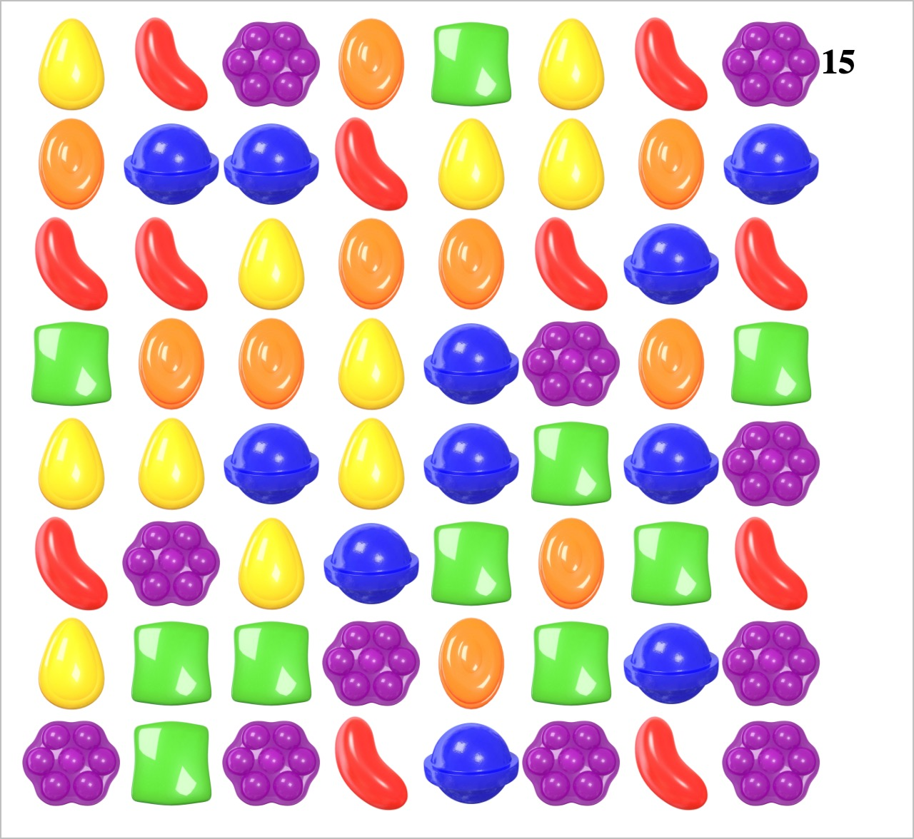

# Candy Crush React

A simple Candy Crush-style game built with React. Match candies, score points, and have fun while learning React fundamentals!

## 🚀 Learning Outcomes
- Understand React functional components and hooks (`useState`, `useEffect`)
- Manage state for a dynamic game board
- Implement drag-and-drop mechanics in React
- Work with images and CSS for a game UI
- Practice basic game logic (matching, scoring)

## 🕹️ How to Run
1. Install dependencies: `npm install`
2. Start the app: `npm start`
3. Open [http://localhost:3000](http://localhost:3000) in your browser

## 📁 Project Structure
- `src/App.js`: Main game logic and board rendering
- `src/components/ScoreBoard.js`: Displays the current score
- `src/images/`: Candy images
- `src/index.css`: Basic styling

Enjoy matching candies and learning React! 🍬
